---

### <picture></picture> About Me

🎓 Computer Science Engineering Undergraduate

Started with tutorials like everyone else, then got tired of building things I didn't understand - so I shifted to breaking them and figuring out why they failed.

Full-stack by practice, backend by preference.

 

> 🔍 I care about what's under the surface - how auth actually works, API design, why things break and how to stop them. That's the part I find interesting.
> 
> 🏋🏼 Outside of code, I train at the gym most days.
> 
> 🚀 Building real projects, sharpening problem-solving, and getting ready for placements.

---

## 📊 GitHub Stats

  

  

    

  

---

### 🤝 Connect with Me

  
  &nbsp;
  

